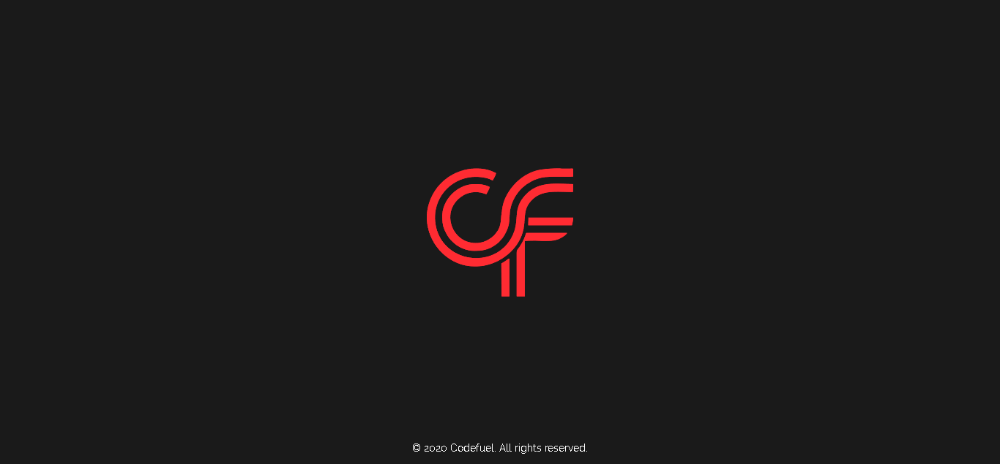

# Codefuel Server Default Page

## Screenshot

---
## About
This is the default page for our servers. We replace the apache or nginx default page with this on our servers. When someone tries to access the server via IP or tries to access restricted data, this page is served.